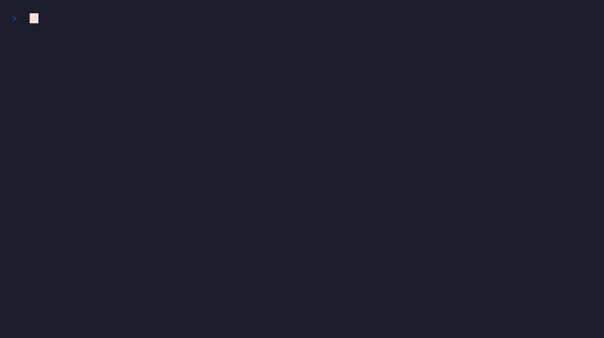

# SandCastle

**Your AI agent has root access to your machine. SandCastle gives it a sandbox instead.**

[](https://github.com/openshield-dev/sandcastle/actions/workflows/ci.yml)
[](https://opensource.org/licenses/Apache-2.0)
[](https://www.rust-lang.org/)
[](https://github.com/openshield-dev)

### Why SandCastle?

- **Zero config** — pre-built profiles for Claude Code, Codex, Ollama, LangChain. Just wrap your command.
- **Single binary** — no Docker, no daemon, no cloud. `cargo install sandcastle` and go.
- **Learn-then-enforce** — run in audit mode first, auto-generate a tight policy from observed behavior.

```bash
# Install and sandbox your AI agent in 10 seconds
cargo install sandcastle
sandcastle run --profile claude-code -- claude
```

<!-- TODO: Replace with an asciinema recording or GIF showing sandcastle in action -->
<!-- <p align="center"></p> -->

---

## Common Scenarios

- **Running Claude Code on a client repo** without exposing `~/.ssh`, `~/.aws`, or env secrets
- **Letting an AutoGPT agent browse the web** without touching your home directory
- **CI pipeline with audited agent steps** — every file access and network call logged
- **Local LLM inference with Ollama** — GPU passthrough inside the sandbox, host isolated

---

## Quick Start

```bash
# Install
cargo install sandcastle

# Run with a zero-config agent profile
sandcastle run --profile claude-code -- claude
sandcastle run --profile ollama -- ollama run llama3
sandcastle run --profile codex -- codex

# Grant specific permissions without a named profile
sandcastle run --allow-dir ./data --allow-net api.github.com -- python agent.py

# Prompt for permission on each new resource access (mobile-OS style)
sandcastle run --interactive -- python agent.py

# Audit mode: log everything but do not block anything
sandcastle run --mode=audit -- python agent.py
```

---

## The Problem

Local AI agents run with your full user permissions. They can read your SSH keys, modify your shell config, exfiltrate environment variables, and make arbitrary network requests.

| Tool | Cross-platform | No Docker | GPU passthrough | Zero config | Snapshots |
|------|:-:|:-:|:-:|:-:|:-:|
| **SandCastle** | Linux, macOS, Windows | Yes | Yes | Yes | Yes |
| Firejail | Linux only | Yes | No | No | No |
| Bubblewrap | Linux only | Yes | No | No | No |
| E2B | Cloud only | N/A | No | Partial | No |
| Docker | All | No (requires Docker) | Complex | No | No |

---

## Graduated Trust Levels

SandCastle uses five trust levels. Each level is a preset policy you can use as a starting point, then extend with `--allow-*` flags or a `sandcastle.yaml` file.

| Level | Filesystem | Network | Process Spawn | GPU | Use Case |
|---|---|---|---|---|---|
| **Explore** | Read-only, home dir excluded | Blocked | Blocked | Blocked | Untrusted or unknown agents |
| **Develop** *(default)* | Read-write within project dir | Allowlisted domains only | Restricted | Blocked | Day-to-day coding agents |
| **Build** | Read-write project + build cache | Package registries + allowlist | Allowed | Blocked | CI/CD agents, build systems |
| **Full** | Read-write everywhere except `/etc`, `/root` | Unrestricted outbound | Allowed | Passthrough | Trusted agents needing broad access |
| **Unrestricted** | No restrictions | No restrictions | No restrictions | Passthrough | Escape hatch — no isolation applied |

---

## Features

### Pre-built Agent Profiles

Common agents ship with sensible defaults out of the box. No configuration needed.

```bash
sandcastle run --profile claude-code -- claude
sandcastle run --profile codex -- codex
sandcastle run --profile langchain -- python my_agent.py
sandcastle run --profile ollama -- ollama serve
sandcastle run --profile openclaw -- openclaw run
```

Profiles define filesystem mounts, allowed network destinations, syscall filters, and resource limits tuned for each agent's actual runtime requirements.

### Filesystem Isolation

SandCastle intercepts all filesystem access using OS primitives — no userspace proxying.

- **OverlayFS** (Linux): upper/lower layer model; writes go to a scratch layer and never touch the real filesystem unless explicitly committed
- **Copy-on-write**: file modifications are isolated to the sandbox; original files are untouched
- **Bind mounts**: expose only the directories the agent needs, nothing else
- **Path allowlists**: deny access to `~/.ssh`, `~/.aws`, `~/.gnupg`, and other sensitive directories by default

### Network Filtering

All outbound connections pass through SandCastle's network layer.

- DNS-based domain filtering with an explicit allowlist
- Egress control with per-destination rules
- TLS certificate verification enforced (no MITM by the agent)
- Block or log connections to unexpected destinations
- Full request logging in audit mode

### Snapshot and Restore

Agents can't permanently break your environment when every run is reversible.

```bash
# Create a named snapshot before a risky operation
sandcastle snapshot create pre-refactor

# Show what changed inside the sandbox
sandcastle snapshot diff pre-refactor

# Roll the sandbox back to a known-good state
sandcastle snapshot restore pre-refactor

# Branch from an existing snapshot for parallel experiments
sandcastle snapshot branch pre-refactor experiment-a
```

### GPU Passthrough

Local LLM inference works inside the sandbox. SandCastle exposes the GPU to the sandboxed process while keeping the rest of the host isolated.

- **Linux**: gVisor nvproxy for NVIDIA GPUs; VFIO for full device passthrough
- **Windows**: GPU-PV (GPU Paravirtualization) via Hyper-V
- GPU access is opt-in; disabled by default in Explore and Develop profiles

### Audit Logging

Every syscall, filesystem access, network connection, and process spawn is recorded as a structured JSONL event.

```bash
# Run in audit mode to build a baseline without blocking anything
sandcastle run --mode=audit -- python agent.py

# View the audit log
sandcastle audit log --tail 100

# Export to a file for offline analysis
sandcastle audit export --format jsonl --out agent-run.jsonl

# Show policy violations from the last run
sandcastle audit violations
```

### Interactive Permission Prompts

When an agent attempts an action not covered by its current policy, SandCastle can pause and ask rather than silently block.

```bash
sandcastle run --interactive -- python agent.py
# Agent tries to connect to an unknown host:
# [SandCastle] agent.py wants to connect to analytics.vendor.com:443
# Allow once / Allow always / Deny / Deny always? _
```

### Learn-Then-Enforce

Run your agent in audit mode first to capture what it actually does, then generate a tight policy from the trace.

```bash
# Step 1: observe
sandcastle run --mode=audit -- python agent.py

# Step 2: generate a policy from the observed behavior
sandcastle policy generate --from-audit --out sandcastle.yaml

# Step 3: enforce
sandcastle run --config sandcastle.yaml -- python agent.py
```

---

## Platform Support

| Platform | Isolation Mechanism | Status |
|---|---|---|
| **Linux** | Landlock + Seccomp + Linux namespaces + cgroups | Stable |
| **macOS** | Apple Endpoint Security framework | Beta |
| **Windows** | Hyper-V + AppContainer + Job Objects | Beta |

---

## Architecture

```
┌──────────────────────────────────────────────────────────────┐
│                        sandcastle run                        │
│                                                              │
│  ┌─────────────┐   ┌──────────────┐   ┌──────────────────┐  │
│  │   Policy    │   │   Profile    │   │  CLI / Config    │  │
│  │   Engine    │◄──│   Registry   │◄──│  sandcastle.yaml │  │
│  └──────┬──────┘   └──────────────┘   └──────────────────┘  │
│         │                                                    │
│         ▼                                                    │
│  ┌──────────────────────────────────────────────────────┐   │
│  │                  Sandbox Runtime                     │   │
│  │                                                      │   │
│  │  ┌────────────┐  ┌────────────┐  ┌────────────────┐  │   │
│  │  │    FS      │  │  Network   │  │    Process     │  │   │
│  │  │ Isolation  │  │  Filter    │  │    Control     │  │   │
│  │  │(OverlayFS) │  │  (DNS/IP)  │  │  (namespaces)  │  │   │
│  │  └────────────┘  └────────────┘  └────────────────┘  │   │
│  │                                                      │   │
│  │  ┌────────────┐  ┌────────────┐  ┌────────────────┐  │   │
│  │  │  Snapshot  │  │    GPU     │  │     Audit      │  │   │
│  │  │  Manager   │  │ Passthrough│  │     Logger     │  │   │
│  │  └────────────┘  └────────────┘  └────────────────┘  │   │
│  └──────────────────────────────────────────────────────┘   │
│                            │                                 │
│                            ▼                                 │
│                     [ Agent Process ]                        │
└──────────────────────────────────────────────────────────────┘
```

---

## CLI Reference

```
sandcastle run       Wrap a command in a sandbox
sandcastle snapshot  Manage filesystem snapshots (create/diff/restore/branch)
sandcastle policy    Generate, validate, or inspect policies
sandcastle audit     View and export audit logs
sandcastle profiles  List available agent profiles and their permissions
```

Run `sandcastle <command> --help` for full flag documentation.

---

## Configuration

A `sandcastle.yaml` file in your project root is picked up automatically. All fields are optional — omit what you do not need.

```yaml
# sandcastle.yaml

profile: develop          # base trust level (explore/develop/build/full/unrestricted)

filesystem:
  allow:
    - ./src               # relative paths resolve from the project root
    - ./data
    - /tmp/agent-scratch
  deny:
    - ~/.ssh
    - ~/.aws
  overlay: true           # use OverlayFS; writes are isolated unless committed

network:
  allow:
    - api.github.com
    - pypi.org
    - registry.npmjs.org
  deny_by_default: true   # block everything not in the allow list

process:
  max_children: 16
  deny_setuid: true

gpu:
  enabled: false          # set true to allow GPU access

audit:
  path: .sandcastle/audit.jsonl
  violations_only: false  # set true to log only blocked actions

interactive: false        # set true to prompt on unknown resource access
```

---

## Part of OpenShield

SandCastle is part of the **OpenShield** ecosystem — open-source infrastructure for running AI agents safely.

| Project | Purpose |
|---|---|
| **SandCastle** | OS-level sandbox for local AI agents |
| **PipeLocal** | Secure inter-process communication for agent pipelines |
| **AgentGuard** | Runtime behavior monitoring and anomaly detection |
| **AIScan** | Static analysis for agent code and prompts |
| **SkillForge** | Verified skill registry with sandboxed execution |

---

## Contributing

Contributions are welcome. Please open an issue before starting work on a large change so we can discuss the approach.

```bash
git clone https://github.com/openshield/sandcastle
cd sandcastle
cargo build
cargo test
```

The codebase is organized as a Cargo workspace. Each isolation subsystem lives in its own crate under `crates/`. The CLI entry point is `crates/sandcastle-cli`.

Before submitting a pull request:

- Run `cargo clippy -- -D warnings` and fix all warnings
- Run `cargo fmt --check`
- Add tests for new behavior; do not remove existing tests
- Update relevant documentation in the crate's `README` or inline docs

---

## License

Apache 2.0. See [LICENSE](LICENSE) for the full text.
